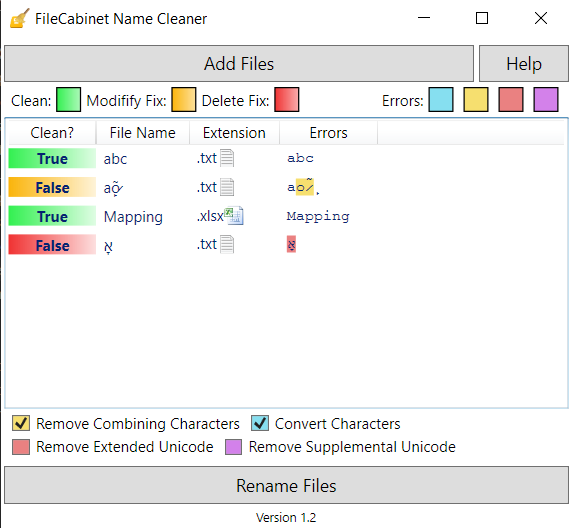

# CS FileCabinet Renamer

A simple app for renaming selected files to work in CS FileCabinet.

When uploading file to FileCabinet, if the file name has invalid characters in the name, the file
will upload, but the contents will be lost and the file will be corrupted without any warning from FileCabinet.

Invalid characters include:
- Combination Characters
	- Example: è
		- The above is a combination of two characters "e" and "̀◌" (Combining Grave Accent)
		- Note: This "è" is a single character and is valid.
- Any Unicode character beyond Latin-1 (0xFF)
	- Greek, Cyrillic, Hebrew, Arabic, ect.
- Emojis

- Note: This program is unliley to be updated as the firm I work at no longer uses FileCabinet.
